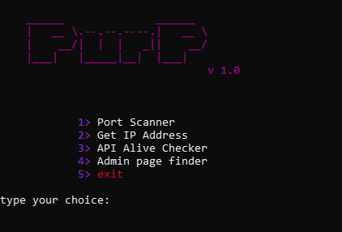

# purp

<pre>

</pre>

## Install and Run
```bash
git clone https://github.com/theFr3Y/purp/
cd purp
pip install -r require.txt
python PurP.py
```
## Alpha version 1.0
- Added colors and design to the script
- Fixed some errors

## Tested Consoles:
- Bash
- CMD
- PowerShell
-Termux
